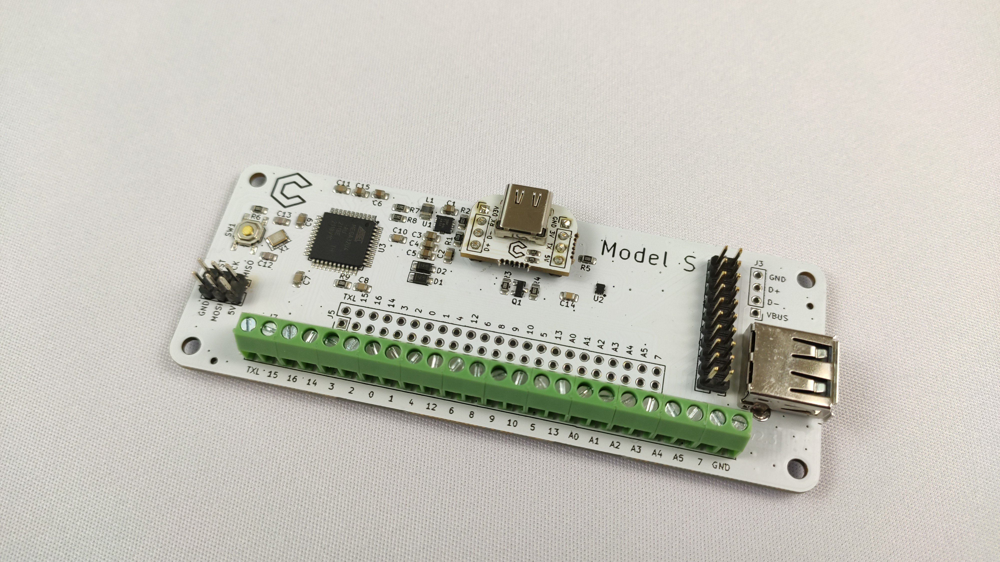

# Model-S
This circuit board is a complete solution for making custom all digital GameCube controllers without soldering.

## Features
- Connects to GameCube/Wii/GCC to USB adapter using the USB-C to GameCube cables that are sold on the Frame1 and the B0XX websites
- Connect buttons with screw terminals or 2.54mm pitch through holes
- Easily connect to a Brook Board to use the controller on PlayStation/Xbox/other consoles, with both boards sharing the Model S USB-C port
- Can be powered with just 3.3V, allowing the board to work on Mayflash adapters without the gray USB cable as well as GameCube/Wii consoles with faulty rumble lines

## Resources

User Manual - https://www.craneslab.xyz/manuals/s

Firmware - https://github.com/Crane1195/CL-FW

Questions - https://craneslab.xyz/discord

## License
This project is licenced under the GNU GPL Version 3. [See the included LICENSE file for details](LICENSE).

## Support my work
I set up a donation link for people who appreciate my work and wish to donate. Donations are greatly appreciated, but are far from necessary:

https://www.paypal.com/donate/?hosted_button_id=NFDEML5FKR8N8